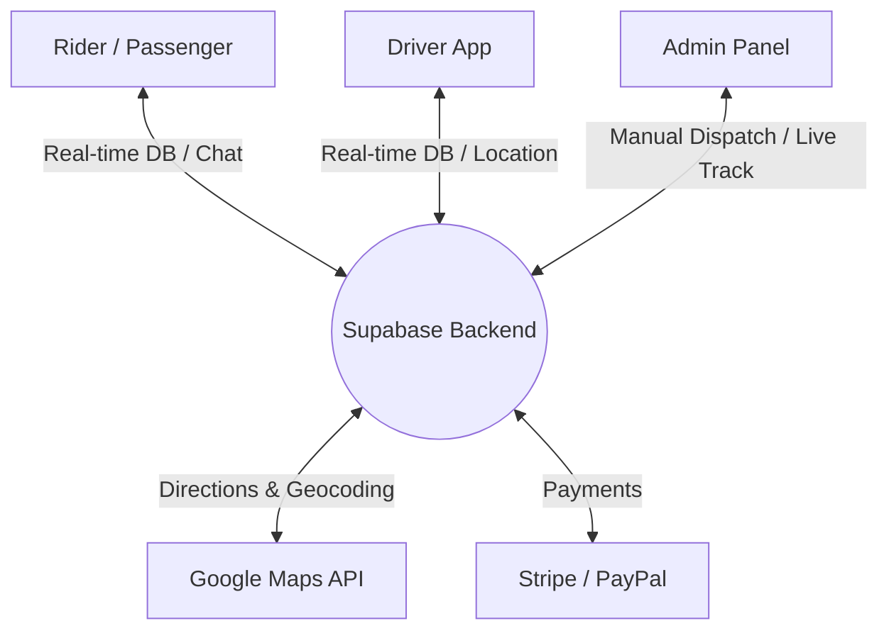
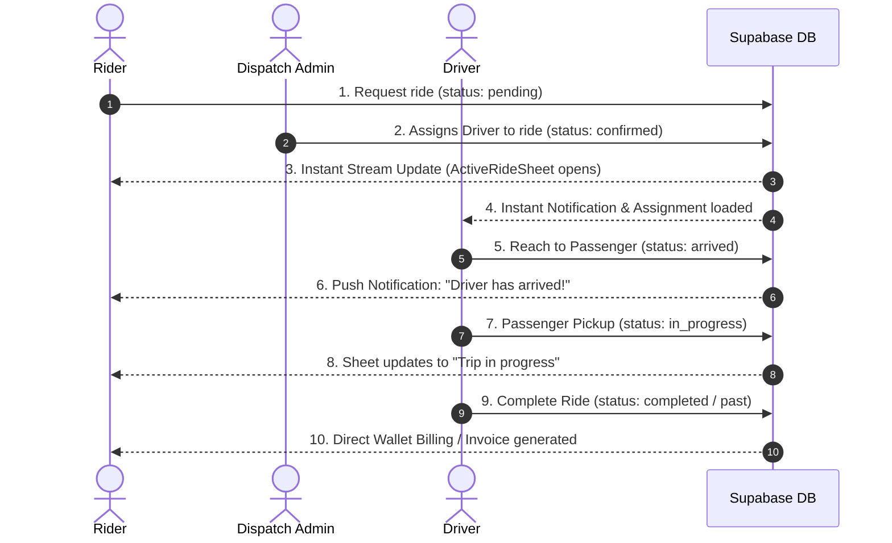

# Rockies Royal Routes - Project Presentation

Welcome to the **Rockies Royal Routes** presentation! This document provides a comprehensive, high-level overview of the entire Rockies Royal Routes ecosystem, covering its architecture, the three major user portals (Rider, Driver, and Admin), key screens, technical stack, and core database workflows.

---

## 🌟 Executive Summary

**Rockies Royal Routes** is an enterprise-grade, luxury-focused ride-hailing and fleet management platform built using **Flutter**. Designed to deliver a premium executive transport experience, the platform bridges passengers, drivers, and dispatch administrators into a single unified system.

---

## 🏗 System Architecture

The project follows a clean **Layered Architecture** split by feature modules in the presentation layer, relying on Riverpod for highly responsive reactive state management.

1. **Presentation Layer (`lib/presentation/`)**: Responsive UI widgets structured around feature modules (Auth, Booking, Driver, Chat, Admin, Wallet).
2. **Domain Layer (`lib/domain/`)**: Repository abstractions defining contract structures.
3. **Data Layer (`lib/data/`)**: Concrete implementations of repositories interfacing with Supabase, Dio, and local geocoding services.
4. **Core Layer (`lib/core/`)**: Routing configurations (GoRouter), global application configurations, and theme customizers.

---

## 📱 The Three Major Portals

### 1. The Rider (Client) App
Provides a premium booking experience from initiation to completion.
* **Onboarding & Auth**: Secure onboarding, user profile configuration, and saved custom locations (Home, Work, Custom).
* **Interactive Booking**: Interactive map-driven pickup/dropoff selection with reverse-geocoding, distance matrix calculations, and multi-service options (Transport, Delivery, Rental).
* **Luxury Fleet Selection**: High-end car selections displaying specific prices, passenger, and luggage capacities.
* **Flexible Payments**: Billed directly using a native App Wallet, Stripe (Credit Card), PayPal, or Cash.
* **Active Ride Tracking**: Live interactive sheet displaying driver's location on the map, real-time driver ETA, dynamic distance calculation, call/chat actions, and a safety-focused **Cancel & Book Again** button.

### 2. The Driver App
A dedicated workflow empowering drivers to manage their day and complete assigned rides.
* **Performance Dashboard**: Real-time stats showing Today's Earnings, Total Trips, and Driver Rating.
* **Active Assignments**: Instantly updates when an administrator assigns a trip.
* **Interactive Navigation**: Real-time segment route mapping showing the route to the passenger's pickup spot and then onwards to the dropoff. Supports launching native Google Maps turn-by-turn navigation directly.
* **Instant Notifications & Chat**: Push notifications and chat options to easily coordinate with passengers.

### 3. The Admin App / Panel
A control deck for fleet managers and dispatch coordinators.
* **Manual Dispatching**: Allows administrators to view all pending bookings, filter active drivers, and manually assign bookings.
* **Live Fleet Tracking**: Real-time map displaying all online drivers, their tracking states, and active trip pathways.

---

## 🗺 Interactive Booking & Trip Lifecycle

The flowchart below demonstrates the precise sequence from a customer making a request to the completion of the trip:

---

## 🗺 Interactive Screen Architecture

Below is a map of the screen architecture detailing what each interface accomplishes in the codebase:

| Screen | Route Path | Description | Key Code References |
| :--- | :--- | :--- | :--- |
| **Splash & Onboarding** | `/` & `/onboarding` | Premium startup flow introducing the Rockies Royal theme. | [splash_screen.dart](file:///Users/a-y-a/AndroidStudioProjects/rockies_royal%20independent/lib/presentation/auth/splash_screen.dart) |
| **Rider Map Dashboard** | `/home` | Main map control room featuring live location tracking, quick toggle buttons, and search overlays. | [home_screen.dart](file:///Users/a-y-a/AndroidStudioProjects/rockies_royal%20independent/lib/presentation/home/home_screen.dart) |
| **Location Search** | `/search` | Fast autocomplete address search powered by Google Places API. | [location_search_screen.dart](file:///Users/a-y-a/AndroidStudioProjects/rockies_royal%20independent/lib/presentation/search/location_search_screen.dart) |
| **Available Fleet** | `/available-cars` | Visual listing of premium vehicles displaying capacity limits and total dynamic fare estimates. | [available_cars_screen.dart](file:///Users/a-y-a/AndroidStudioProjects/rockies_royal%20independent/lib/presentation/booking/available_cars_screen.dart) |
| **Active Ride Sheet** | (Embedded in `/home`) | Interactive sheet containing driver card, chat/call triggers, live distance markers, and **Cancel & Book Again** controls. | [active_ride_sheet.dart](file:///Users/a-y-a/AndroidStudioProjects/rockies_royal%20independent/lib/presentation/home/widgets/active_ride_sheet.dart) |
| **Driver Dashboard** | `/driver-home` | Central panel for drivers displaying earnings, today's trips count, feedback rating, and active ride tasks. | [driver_home_screen.dart](file:///Users/a-y-a/AndroidStudioProjects/rockies_royal%20independent/lib/presentation/driver/driver_home_screen.dart) |
| **Driver Navigation** | `/driver-trip-route` | Real-time map router for the driver showing routes to pickup and destination, complete with turn-by-turn navigation. | [driver_trip_route_screen.dart](file:///Users/a-y-a/AndroidStudioProjects/rockies_royal%20independent/lib/presentation/driver/driver_trip_route_screen.dart) |
| **Admin Dispatch Deck** | `/assign-booking` | Control desk allowing manual assignment of pending passenger rides to registered drivers. | [assign_booking_screen.dart](file:///Users/a-y-a/AndroidStudioProjects/rockies_royal%20independent/lib/presentation/admin/assign_booking_screen.dart) |
| **Real-time Chat** | `/chat/:tripId` | Live chat between passengers and drivers, leveraging Supabase realtime message listeners. | [chat_screen.dart](file:///Users/a-y-a/AndroidStudioProjects/rockies_royal%20independent/lib/presentation/chat/chat_screen.dart) |

---

## 📱 Comprehensive Screen-by-Screen Breakdown

This section documents the specific role, interactive features, and technical design of **every screen** in the Rockies Royal Routes codebase:

### 1. Onboarding & Authentication Module
* **Splash Screen (`/`)**:
  * **Role**: App initialization.
  * **Features**: Displays the luxurious gold-on-black Rockies logo with smooth fade-in animations. Checks for valid Supabase sessions and fetches metadata (e.g. system configurations, map configurations) to route the user appropriately.
  * **Reference**: [splash_screen.dart](file:///Users/a-y-a/AndroidStudioProjects/rockies_royal%20independent/lib/presentation/auth/splash_screen.dart)
* **Onboarding Screen (`/onboarding`)**:
  * **Role**: Marketing and user walkthrough.
  * **Features**: Explains the features of the app (premium fleets, experienced chauffeurs, secure digital wallet) using interactive high-resolution slideshow pages.
  * **Reference**: [onboarding_screen.dart](file:///Users/a-y-a/AndroidStudioProjects/rockies_royal%20independent/lib/presentation/onboarding/onboarding_screen.dart)
* **Welcome Screen (`/welcome`)**:
  * **Role**: Gateway selection.
  * **Features**: Gives a premium first-impression gateway where users choose to proceed to client login, driver logging, or administrative portal views.
  * **Reference**: [welcome_screen.dart](file:///Users/a-y-a/AndroidStudioProjects/rockies_royal%20independent/lib/presentation/auth/welcome_screen.dart)
* **Login Screen (`/login`)**:
  * **Role**: Client sign-in.
  * **Features**: Securely authenticates riders via Supabase Auth. Input validations are conducted on email format and password strength, featuring password reveal toggles and standard styling.
  * **Reference**: [login_screen.dart](file:///Users/a-y-a/AndroidStudioProjects/rockies_royal%20independent/lib/presentation/auth/login_screen.dart)
* **Register Screen (`/register`)**:
  * **Role**: Client account registration.
  * **Features**: Prompts the user for a full profile setup (Name, Phone number, Email, and Password). Leverages Supabase database triggers to automatically initialize a matching client profile database entry upon sign-up.
  * **Reference**: [register_screen.dart](file:///Users/a-y-a/AndroidStudioProjects/rockies_royal%20independent/lib/presentation/auth/register_screen.dart)
* **Forgot Password Screen (`/forgot-password`)**:
  * **Role**: Credential recovery.
  * **Features**: Allows riders to input their registered email address to trigger a password reset link from Supabase Auth.
  * **Reference**: [forgot_password_screen.dart](file:///Users/a-y-a/AndroidStudioProjects/rockies_royal%20independent/lib/presentation/auth/forgot_password_screen.dart)
* **Admin Login Screen (`/admin-login`)**:
  * **Role**: Secured administrative sign-in.
  * **Features**: Allows operations managers to securely access the administrative system dashboards with additional verification parameters.
  * **Reference**: [admin_login_screen.dart](file:///Users/a-y-a/AndroidStudioProjects/rockies_royal%20independent/lib/presentation/auth/admin_login_screen.dart)

### 2. Rider Maps & Booking Module
* **Home Screen (`/home`)**:
  * **Role**: Core passenger dashboard.
  * **Features**: Renders a luxury-styled Google Map with a custom dark skin. Hosts the sliding overlay bottom sheets:
    * **Where to Go? Sheet**: Simple prompt showcasing saved locations and an address search input.
    * **Booking Status Sheet**: Real-time progress updates (*"Searching for Drivers"*, *"Your driver is on the way"*, *"Trip Active"*).
    * **Active Ride Sheet**: Shows the active driver's photo, ratings, car model, live distance, chat/call triggers, and the **Cancel & Book Again** button to clear stuck bookings.
  * **Reference**: [home_screen.dart](file:///Users/a-y-a/AndroidStudioProjects/rockies_royal%20independent/lib/presentation/home/home_screen.dart)
* **Location Search Screen (`/search`)**:
  * **Role**: Address resolution and autocomplete.
  * **Features**: Connects with coordinates databases to display auto-completing address suggestions as the rider types. Returns coordinate variables back to the main booking loop.
  * **Reference**: [location_search_screen.dart](file:///Users/a-y-a/AndroidStudioProjects/rockies_royal%20independent/lib/presentation/search/location_search_screen.dart)
* **Booking Screen (`/booking`)**:
  * **Role**: Travel scheduling.
  * **Features**: Prompts the user to configure travel details, pick specific service types, select payment modes (Wallet, Credit Card, or Cash), and verify calculations.
  * **Reference**: [booking_screen.dart](file:///Users/a-y-a/AndroidStudioProjects/rockies_royal%20independent/lib/presentation/booking/booking_screen.dart)
* **Available Cars Screen (`/available-cars`)**:
  * **Role**: Interactive vehicle list.
  * **Features**: Lists all accessible vehicle categories alongside passenger capacity limits, luggage slots, estimated time of arrival (ETA), and total prices.
  * **Reference**: [available_cars_screen.dart](file:///Users/a-y-a/AndroidStudioProjects/rockies_royal%20independent/lib/presentation/booking/available_cars_screen.dart)
* **Car Details Screen (`/car-details`)**:
  * **Role**: Vehicle specification viewer.
  * **Features**: Provides a detailed listing of standard amenities included in the chosen car level (e.g. WiFi availability, climate controls, seating configurations).
  * **Reference**: [car_details_screen.dart](file:///Users/a-y-a/AndroidStudioProjects/rockies_royal%20independent/lib/presentation/booking/car_details_screen.dart)
* **Booking Success Screen (`/booking-success`)**:
  * **Role**: Dispatch feedback.
  * **Features**: Shows a luxurious booking confirmation checkmark indicating that their request has successfully been logged and dispatchers are assigning a matching vehicle.
  * **Reference**: [booking_success_screen.dart](file:///Users/a-y-a/AndroidStudioProjects/rockies_royal%20independent/lib/presentation/booking/booking_success_screen.dart)

### 3. Digital Wallet & Transactions
* **Add Amount Screen (`/add-amount`)**:
  * **Role**: Ledger top-up gateway.
  * **Features**: Features text inputs and pre-formatted quick-add buttons (e.g. +$50, +$100) allowing riders to securely fund their virtual Rockies wallet balance.
  * **Reference**: [add_amount_screen.dart](file:///Users/a-y-a/AndroidStudioProjects/rockies_royal%20independent/lib/presentation/wallet/add_amount_screen.dart)
* **Wallet Confirmation Screen (`/wallet-confirmation`)**:
  * **Role**: Payment checklist review.
  * **Features**: Breaks down payment variables showing final top-up figures, card processing fees, and wallet balance summaries before updating database records.
  * **Reference**: [wallet_confirmation_screen.dart](file:///Users/a-y-a/AndroidStudioProjects/rockies_royal%20independent/lib/presentation/booking/wallet_confirmation_screen.dart)
* **Invoice Screen (`/invoice`)**:
  * **Role**: Financial receipt generation.
  * **Features**: Displays a detailed transaction statement outlining starting fares, distance/duration charges, promo codes, and payment status details.
  * **Reference**: [invoice_screen.dart](file:///Users/a-y-a/AndroidStudioProjects/rockies_royal%20independent/lib/presentation/booking/invoice_screen.dart)

### 4. Interactive Driver Suite
* **Driver Home Screen (`/driver-home`)**:
  * **Role**: Duty console and dashboard.
  * **Features**: The home dashboard for chauffeurs. Features a prominent toggle to shift online/offline. Displays current ratings, total daily trips completed, total earnings, and triggers modal overlays for new dispatch requests.
  * **Reference**: [driver_home_screen.dart](file:///Users/a-y-a/AndroidStudioProjects/rockies_royal%20independent/lib/presentation/driver/driver_home_screen.dart)
* **Driver Trip Route Screen (`/driver-trip-route`)**:
  * **Role**: Real-time navigation guide.
  * **Features**: Renders a dedicated route map illustrating directions to the customer's pickup and dropoff locations. Houses status sliders that update Supabase (*Arrived*, *Start Trip*, *Complete Trip*).
  * **Reference**: [driver_trip_route_screen.dart](file:///Users/a-y-a/AndroidStudioProjects/rockies_royal%20independent/lib/presentation/driver/driver_trip_route_screen.dart)
* **Vehicles Screen (`/vehicles`)**:
  * **Role**: Fleet assignment panel.
  * **Features**: Allows drivers to review their currently assigned vehicle, inspect registration plates, and configure service category parameters.
  * **Reference**: [vehicles_screen.dart](file:///Users/a-y-a/AndroidStudioProjects/rockies_royal%20independent/lib/presentation/screens/vehicles_screen.dart)

### 5. Administrative Control Deck
* **Admin Panel Screen (`/admin-panel`)**:
  * **Role**: Master administration board.
  * **Features**: Displays real-time operational statistics such as total active rides, total earnings, registered driver listings, unassigned travel queues, and links to tracking utilities.
  * **Reference**: [admin_panel_screen.dart](file:///Users/a-y-a/AndroidStudioProjects/rockies_royal%20independent/lib/presentation/admin/admin_panel_screen.dart)
* **Assign Booking Screen (`/assign-booking`)**:
  * **Role**: Trip dispatch console.
  * **Features**: Lists unassigned passenger bookings in real-time. Operations managers can manually pick bookings and choose an active driver from a dropdown list to dispatch the booking.
  * **Reference**: [assign_booking_screen.dart](file:///Users/a-y-a/AndroidStudioProjects/rockies_royal%20independent/lib/presentation/admin/assign_booking_screen.dart)
* **Track Driver Screen (`/track-drivers`)**:
  * **Role**: Real-time fleet roster.
  * **Features**: Displays an operational list of all registered chauffeurs. Shows their real-time duty status (Online/Offline/On Trip) and includes tracking shortcut actions next to active listings.
  * **Reference**: [track_driver_screen.dart](file:///Users/a-y-a/AndroidStudioProjects/rockies_royal%20independent/lib/presentation/admin/track_driver_screen.dart)
* **Live Tracking Screen (`/live-tracking/:driverId/:driverName`)**:
  * **Role**: Real-time GPS operations center.
  * **Features**: Dynamically hooks into Supabase Realtime channels to track active driver coordinates on a custom dark Google Map. Uses reactively drawn markers (Azure default marker) and automated camera centering to ensure high-fidelity live tracking.
  * **Reference**: [live_tracking_screen.dart](file:///Users/a-y-a/AndroidStudioProjects/rockies_royal%20independent/lib/presentation/admin/live_tracking_screen.dart)

### 6. Social, Help, & Account Prefs
* **Chat Screen (`/chat/:tripId`)**:
  * **Role**: Live rider-driver communication.
  * **Features**: A beautiful, real-time message stream using Supabase channel broadcasters. Message entries show delivery states and support timestamps.
  * **Reference**: [chat_screen.dart](file:///Users/a-y-a/AndroidStudioProjects/rockies_royal%20independent/lib/presentation/chat/chat_screen.dart)
* **Notification Screen (`/notification`)**:
  * **Role**: Push alerts logs.
  * **Features**: Provides a list view of historical notifications (e.g. system status announcements, trip updates, promotional discounts).
  * **Reference**: [notification_screen.dart](file:///Users/a-y-a/AndroidStudioProjects/rockies_royal%20independent/lib/presentation/notification/notification_screen.dart)
* **Complain Screen (`/complain`)**:
  * **Role**: Customer support logs.
  * **Features**: Includes descriptive forms to let riders file feedback logs detailing issues with route delays, vehicle cleaning, or driver performance.
  * **Reference**: [complain_screen.dart](file:///Users/a-y-a/AndroidStudioProjects/rockies_royal%20independent/lib/presentation/home/complain_screen.dart)
* **Referral Screen (`/referral`)**:
  * **Role**: Promotional sharing panel.
  * **Features**: Generates user-specific coupon codes which can be shared to gain wallet incentives when new riders join the ecosystem.
  * **Reference**: [referral_screen.dart](file:///Users/a-y-a/AndroidStudioProjects/rockies_royal%20independent/lib/presentation/home/referral_screen.dart)
* **About Us Screen (`/about-us`)**:
  * **Role**: Company profile viewer.
  * **Features**: Highlights Rockies Royal Routes' corporate history, fleet standards, and commitments to executive transport.
  * **Reference**: [about_us_screen.dart](file:///Users/a-y-a/AndroidStudioProjects/rockies_royal%20independent/lib/presentation/home/about_us_screen.dart)

### 7. Profile & Settings Customizers
* **Profile Screen (`/profile`)**:
  * **Role**: Rider profile core.
  * **Features**: Links users to edit profile cards, configure travel customization engines, view historical trips, update payment credentials, or sign out.
  * **Reference**: [profile_screen.dart](file:///Users/a-y-a/AndroidStudioProjects/rockies_royal%20independent/lib/presentation/profile/profile_screen.dart)
* **Personal Information Screen (`/personal-info`)**:
  * **Role**: Personal info editor.
  * **Features**: Updates core fields (profile avatars, full names, mobile contact details) directly in Supabase databases.
  * **Reference**: [personal_information_screen.dart](file:///Users/a-y-a/AndroidStudioProjects/rockies_royal%20independent/lib/presentation/profile/personal_information_screen.dart)
* **Change Password Screen (`/change-password`)**:
  * **Role**: Authentication guard update.
  * **Features**: Safely modifies account access passwords, validating length and strength beforehand.
  * **Reference**: [change_password_screen.dart](file:///Users/a-y-a/AndroidStudioProjects/rockies_royal%20independent/lib/presentation/profile/change_password_screen.dart)
* **Saved Locations Screen (`/saved-locations`)**:
  * **Role**: Travel shortcuts dashboard.
  * **Features**: Provides a direct panel to register, edit, or delete coordinate pointers labeled as *Home*, *Work*, or custom labels.
  * **Reference**: [saved_locations_screen.dart](file:///Users/a-y-a/AndroidStudioProjects/rockies_royal%20independent/lib/presentation/profile/saved_locations_screen.dart)
* **Settings Screen (`/settings`)**:
  * **Role**: Global preferences deck.
  * **Features**: Provides easy access to configure app-wide options (Language controls, Dark/Light interface toggles, support systems).
  * **Reference**: [settings_screen.dart](file:///Users/a-y-a/AndroidStudioProjects/rockies_royal%20independent/lib/presentation/settings/settings_screen.dart)
* **Language Screen (`/language`)**:
  * **Role**: App localization setting.
  * **Features**: Dynamically changes translation libraries (supporting English, Arabic, Spanish, etc.) updating the localized texts on screen.
  * **Reference**: [language_screen.dart](file:///Users/a-y-a/AndroidStudioProjects/rockies_royal%20independent/lib/presentation/settings/language_screen.dart)
* **Privacy Policy Screen (`/privacy-policy`)**:
  * **Role**: User terms viewer.
  * **Features**: Explains legal compliance documentation regarding operational coordinates tracking, billing protocols, and data protection.
  * **Reference**: [privacy_policy_screen.dart](file:///Users/a-y-a/AndroidStudioProjects/rockies_royal%20independent/lib/presentation/settings/privacy_policy_screen.dart)
* **Contact Us Screen (`/contact-us`)**:
  * **Role**: Customer support panel.
  * **Features**: Provides click-to-contact cards supporting standard corporate email links, support hotlines, and location addresses.
  * **Reference**: [contact_us_screen.dart](file:///Users/a-y-a/AndroidStudioProjects/rockies_royal%20independent/lib/presentation/settings/contact_us_screen.dart)
* **Delete Account Screen (`/delete-account`)**:
  * **Role**: Strict security removal.
  * **Features**: Prompts the user for one-time confirmation before calling administrative triggers to securely delete all user-related Supabase profiles and logs.
  * **Reference**: [delete_account_screen.dart](file:///Users/a-y-a/AndroidStudioProjects/rockies_royal%20independent/lib/presentation/settings/delete_account_screen.dart)

### 8. The Customization Engine
* **Customization Screen (`/customization`)**:
  * **Role**: Visual design center.
  * **Features**: Gives users a selection page to jump directly to modifying specific elements of the home map style, general account themes, or detailed booking screens.
  * **Reference**: [customization_screen.dart](file:///Users/a-y-a/AndroidStudioProjects/rockies_royal%20independent/lib/presentation/customization/customization_screen.dart)
* **Home Screen Customization Screen (`/home-customization`)**:
  * **Role**: Home layout modifier.
  * **Features**: Lets users select custom map layouts (Silver luxury styling, Standard Google design, Satellite visuals, Dark Gold themes) and configure layout widget styles.
  * **Reference**: [home_screen_customization_screen.dart](file:///Users/a-y-a/AndroidStudioProjects/rockies_royal%20independent/lib/presentation/customization/home_screen_customization_screen.dart)
* **Profile Customization Screen (`/profile-customization`)**:
  * **Role**: Profile aesthetic customizer.
  * **Features**: Allows riders to modify visual parameters, background card designs, and visual styles of the profile screens.
  * **Reference**: [profile_customization_screen.dart](file:///Users/a-y-a/AndroidStudioProjects/rockies_royal%20independent/lib/presentation/profile/profile_customization_screen.dart)
* **Booking Step Customization Screen (`/booking-step-X-customization`)**:
  * **Role**: Booking steps visual controller.
  * **Features**: Reusable customized layout that customizes the visual style and options for booking steps 1 through 4 (Pickup selection, Vehicle Selection, Payment verification, Dispatch review).
  * **Reference**: [booking_step_customization_screen.dart](file:///Users/a-y-a/AndroidStudioProjects/rockies_royal%20independent/lib/presentation/booking/booking_step_customization_screen.dart)

---

## 🛠 Technology Stack

* **Front-End Development**: Flutter & Dart.
* **State Management**: Flutter Riverpod (`StreamProvider`, `StateNotifier`, `FutureProvider`).
* **Routing**: GoRouter (declarative parameters, smooth page animation transitions).
* **Backend Database & Real-Time Auth**: Supabase (PostgreSQL, custom triggers, real-time database listener channels).
* **Location & Mapping**: Google Maps Flutter SDK, Geolocator, Google Directions API, and Google Distance Matrix API.
* **Push Notifications**: Firebase Messaging (FCM) & local notification managers.
* **Payment Core Integration**: Stripe Payment Intents & PayPal Express Checkout APIs.
